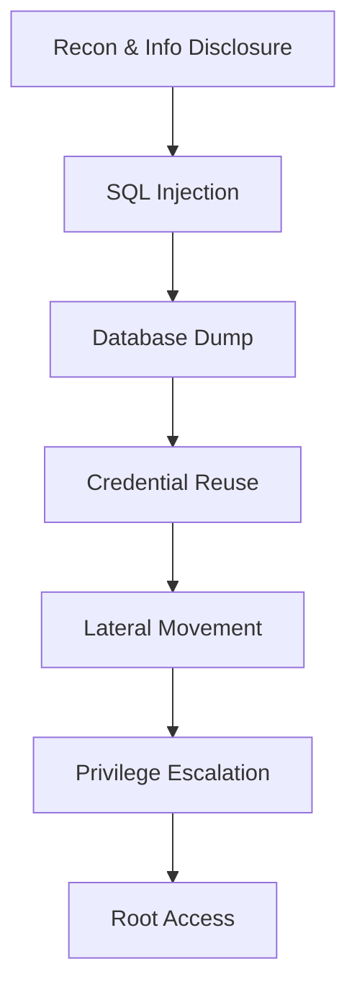

# THM-Biblioteca
Biblioteca Case Study
# 🔐 Penetration Testing Case Study: THM Biblioteca

🚨 **Result:** Achieved full system compromise (root access) from an unauthenticated external position.

---

## 📌 Overview

This project documents a full-scope penetration test conducted against a simulated web application and internal environment hosted on TryHackMe.

The objective was to replicate real-world attack scenarios and identify vulnerabilities that could lead to full system compromise.

> ⚠️ **Assessment Context**  
> This assessment was conducted in a controlled training environment provided by TryHackMe.  
> All methodologies and techniques reflect real-world penetration testing practices.

---

## 🎯 Objectives

- Identify exploitable vulnerabilities in web and internal systems  
- Demonstrate realistic attack paths from initial access to full compromise  
- Provide actionable remediation recommendations  

---

## 🧠 Methodology

The assessment followed a standard penetration testing lifecycle:

- 🔍 **Reconnaissance** – Service enumeration and information gathering  
- 🚪 **Initial Access** – Exploitation of application vulnerabilities  
- 🔑 **Privilege Escalation** – Abuse of misconfigurations and weak controls  
- 🔄 **Post-Exploitation** – Lateral movement and system compromise  

---

## 🔥 Key Findings

### 🔴 SQL Injection → Full Database Compromise
- Authentication bypass via unsanitized input  
- Extracted user credentials from database  
- Enabled unauthorized account access  

### 🔴 Broken Access Control
- Session handling flaws allowed account impersonation  
- Accessed other users without authorization  

### 🔴 Privilege Escalation (Root Access)
- Misconfigured `sudo` permissions with environment manipulation  
- Achieved full system control  

### 🟠 Weak Authentication Controls
- No Multi-Factor Authentication (MFA)  
- Weak and predictable passwords  

---

## ⚔️ Attack Chain

---

## 🧰 Tools Used

- Nmap
- Nikto
- SQLMap
- Burp Suite
- Linux Privilege Escalation Techniques

---

## 🧠 Lessons Learned

- Chaining multiple low-to-critical vulnerabilities leads to full compromise
- Weak authentication controls significantly reduce attack complexity
- Input validation failures remain one of the most critical web security risks
- Misconfigured privilege controls can escalate minor access into total system compromise
